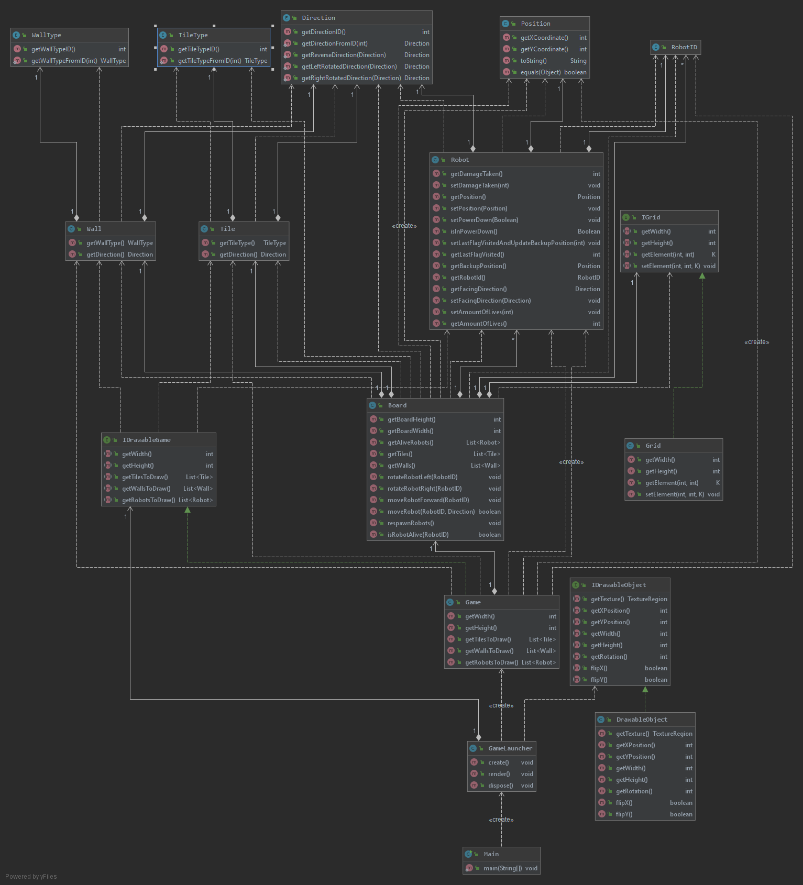
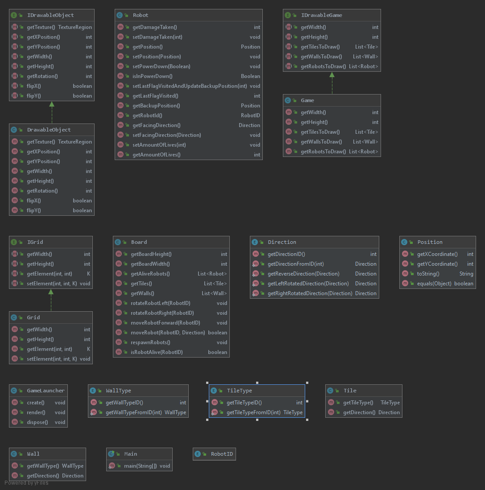

# Team Fiasko

## Deloppgave 1

*   Rollene har fungert greit fram til nå.

### Tobias 
#### Kommunikasjonsleder
##### Har ansvar for å organisere gruppemøter og parprogrameringsmøter
*   Rollen innebærer å finne ut hvilke dager folk kan møte og om vi burde møte i person eller 
    utføre møte digitalt på discord

*   Jeg får også beskjed om noen er syke slik at gruppen kan ta det i betraktning under et møte.

### Kristian 
#### Teamleder
##### Ansvarlig for å vite hva alle gjør og burde gjøre til enhver tid
*   Har holdt styr på prosjekt-tavlen.
*   Har hatt kontroll over hvem som skal gjøre hvilken av oppgavene på prosjekttavlen.
*   Har kontrollert kvaliteten på andres arbeid.

### Steinar 
#### Møteorganisator
##### Ansvarlig for å organisere hva som skal gjennomgås på de avtalte møtene
*   Kommer med en liten plan for hva vi skal snakke om på møtene.
*   Kontrollerer at møter holdes innenfor agendaen.

### Gabriel 
#### Kundekontakt
##### Ansvarlig for å vite alle spilleregler
*   Må svare på spørsmål fra de andre på gruppen angående spillereglene.
*   Må ha kontroll over de forskjellige mekanikkene i spillet.

### Torbjørn 
#### Dokumentasjonsansvarlig
##### Dokumenterer møtene og sørger for at innleveringene er riktige
*   Sørger for at et referat blir skrevet for hvert møte.
*   Har ansvar for at dokumentasjon i og utenfor kode er god nok.
*   Ser over rettskrivning og fikser markdown feil.

### Videre med deloppgave 1
*   Teamet fungerer fint og oppsettet vi har valgt fungerer fint for oss for tiden.

*   Alle blir hørt og det er åpent for å komme med tilbakemeldinger på ting som kan bli bedre.

*   Kommunikasjonen fungerer bra.

*   Kan bli bedre til å ta initiativet med å begynne på oppgaver.

*   Vi synes det var en god idea å planlegge klassestrukturene felles i et grupperom. Det gav alle en god oversikt over
    hva de forskjellige klassen måtte inneholde.

*   Vi har brukt parprogramering som har gjort at commits har blitt en del forskjøvet.

*   En del har blitt diskutert i gruppen der en har gjort alle notater.

### Forbedringpunkter
*   Jevnere commits fra alle på laget
*   Bli bedre på brukerhistorier

## Deloppgave 2

### Krav
1.  En robot som kan bevege seg på brettet.
2.  Forskjellige funksjonelle objekter/ruter på kartet (eks. hull, vegg).
3.  Roboter dør hvis de går utenfor spillbrettet eller faller i et hull.
4.  Roboter må kunne dytte hverandre.
5.  Roboten trenger å kunne ta skade.
6.  En robot trenger liv.
7.  En robot som er ødelagt vil komme tilbake i en backupposisjon med to i skade.
8.  Vise hendelser som skjer på skjermen med en forsinkelse slik at spilleren ser bevegelsene i spillet.

#### Brukerhistorier for krav 1
*Brukerhistorie* 
*   Som robot trenger jeg posisjon en for å ha kontroll på hvor jeg er og hvor jeg skal.

*Akseptansekrav*
*   Vi har en klasse som lagrer en posisjon for en robot på brettet..
*   Posisjoner består av x og y koordinater.
*   Roboten lagrer en instans av positions klassen.

*Brukerhistorie*
*   Som spiller trenger jeg en robot for å kunne spille spillet.

*Akseptansekrav*
*   Vi har en representasjon av en robot, som kan bli plassert på brettet og flyttet på.

*Arbeidsoppgaver*
*   Lage en klasse som representer en posisjon.
*   Roboten må inneholde en posisjon.
*   Lage en klasse som representerer en robot.

#### Brukerhistorier for krav 2

*Brukerhistorie*
*   Som brett må jeg kunne ha forskjellige tiles for å kunne vise alle aspektene ved spillet.

*Akseptansekrav*
*   Å kunne plassere en type tile på brettet.
*   Brettet må kunne vite hvilken tile som er på en bestemt position.

*Brukerhistorie*
*   Som vegg må jeg kunne stoppe en robot fra å gå gjennom meg for å hindre den i å gjøre et ugyldig trekk.

*   Som vegg må jeg kunne bli plassert i forskjellige retninger for 
    å kunne bestemme den funksjonelle retningen til veggen.

*Akseptansekrav*
*   En robot som prøver å gå gjennom en vegg blir stoppet.
*   Kunne plassere vegger i ulike retninger.

*Arbeidsoppgaver*
*   Lage en representasjon av en vegg.
*   Endre bevegelsesmetoden til roboten slik at den følger funksjonaliteten til vegger.
*   Kunne plassere veggen i forskjellige retninger.
*   Legge til en representasjon av et hull.
*   Lage en representasjon av en tile.
*   Legge til en metode i brettet som forteller oss hvilken tile som er i en bestemt posisjon.
*   Legge til en måte for å kunne lage et brett med forskjellige tiles i spesifikke posisjoner.

#### Brukerhistorier for krav 3

*Brukerhistorie*
*   Som spiller må roboten min kunne dø, for å håndtere om roboten tar for mye skade eller går i et hull/ut av kartet.

*Akseptansekrav*
*   Roboten mister et liv hvis den går i et hull eller av brettet.
*   Roboten blir fjernet fra brettet.

*Arbeidsoppgaver*
*   Legge til en metode som fjerner liv fra roboten.

*   Legge til en metode som fjerner en robot fra brettet.

*   Legge til en metode som sjekker posisjonen til roboten for å se om den er gått i et hull eller om den har gått 
    utenfor brettet.

#### Brukerhistorier for krav 4
*Brukerhistorie*
*   Som robot må jeg kunne dytte en annen robot hvis det er lovlig å dytte roboten, for å kunne gjøre et gyldig trekk.

*Akseptansekrav*
*   Hvis en robot beveger seg til en posisjon hvor det er en annen robot, vil den andre roboten bli dyttet så lenge 
    den kan bli dyttet.

*   Hvis den andre roboten blir blokkert av en vegg så kan den ikke bli dyttet og ingen av robotene flytter på seg.

*   Hvis det er flere roboter på rekke, gitt at det ikke er noen vegg som stopper de, blir alle robotene flyttet.

*Arbeidsoppgaver*
*   Legge til funksjonalitet for å sjekke om det er en annen robot i veien.
*   Legge til funksjonalitet for å sjekke om den andre roboten kan bli dyttet i retningen den første roboten peker.
*   Legge til funksjonalitet for å dytte roboter.

#### Brukerhistorier for krav 5
*Brukerhistorie*
*   Som spiller må roboten min kunne ta skade, for å håndtere påvirkning fra objekter som avgir skade til roboter.

*Akseptansekrav*
*   Roboten sin skadeverdi blir økt hvis den tar skade.

*Arbeidsoppgaver*
*   Legge til en skadeverdi i roboten som holder styr på mengden skade roboten har.
*   Legge til en metode for å sette skaden til roboten.
*   Legge til en metode for å hente ut skaden til roboten.

#### Brukerhistorier for krav 6
*Brukerhistorie*
*   Som spiller trenger roboten min liv for å kunne tape.

*Akseptansekrav*
*   Roboten har en verdi som representerer mengden liv den har.

*Arbeidsoppgaver*
*   Legge til en liv-verdi i robot klassen.

#### Brukerhistorier for krav 7
*Brukerhistorie*
*   Som spiller må roboten min kunne gjennoppstå om den har flere liv, for å kunne spille videre.

*Akseptansekrav*
*   En død robot gjennoppstår i en backup-posisjon om den har flere liv.
*   Roboten har 2 i skade etter den gjennoppstår.

*Arbeidsoppgaver*
*   Lage en metode som gjenoppliver en robot i en backup-posisjon og som setter skaden til roboten til 2.

#### Brukerhistorier for krav 8
*Brukerhistorie*
*   Som spiller trenger jeg at det er litt forsinkelse i spiller slik at jeg kan se hva som faktisk skjer.

*Akseptansekrav*
*   Det er en forsinkelse mellom hver handlig som skjer i spillet slik at vi kan følge med på hva som skjer.

*Arbeidsoppgaver*
*   Legge til en forsinkelse mellom hver handling
*   Sørge for at forsinkelsen ikke kræsjer spillet.

### Videre med del 2

*   Vi har prioritert å lage spillet fra bunnen av og opp siden noen deler av spillet avhenger andre.

*Hovedkrav til MVP*

*   Vi føler at alle de syv første kravene er en del av MVP, mens krav 8: Vise hendelser som skjer på skjermen med en
    forsinkelse slik at spilleren ser bevegelsene i spillet, ikke er nødvendig for at spillet skal fungere.

*   Vi har fulgt prioritering av kravene i MVP, men også implementert noen "nice to have" som vi synes er viktig for
    spilleropplevelsen.

*   Siden sist har vi jobbet mer på brett og spilleren, og jobbet med krav 1-7.

*   For å se spesifikke oppgaver som er gjort, sjekk prosjekttavlen på github.

*   Vi vet ikke om noen bugs i koden. Alle kjente bugs har blitt fikset underveis.

*Kjøredetaljer*
*   Siden vi ikke er ferdig med spillet, blir det nå i stedet kjørt en automatisk demo når main kjøres.

*   Demoen demonstrerer at roboter kan skyve hverandre, bli stoppet av vegger, falle i hull og dø av å gå 
    utenfor brettet.

## UML

