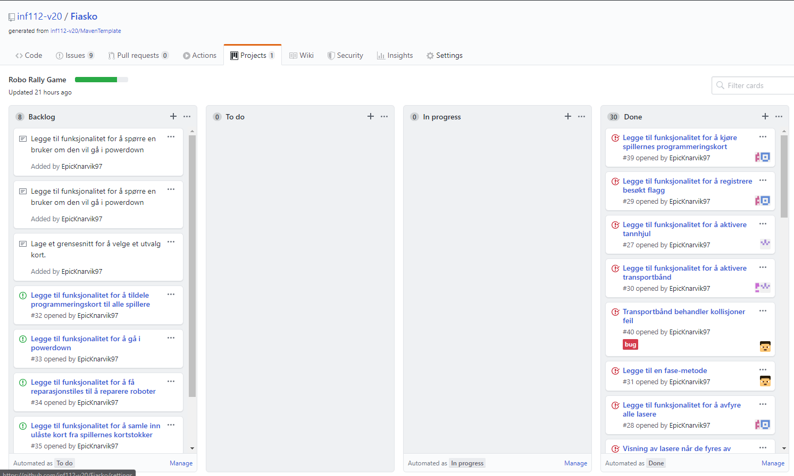
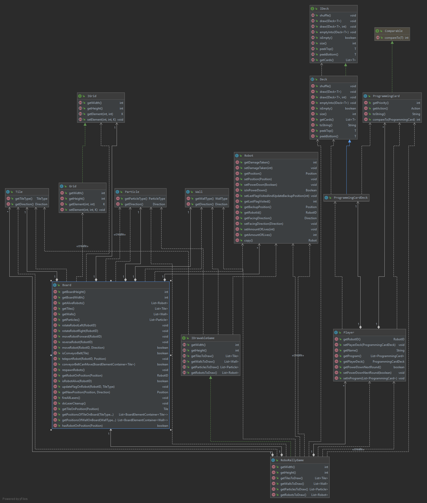

# Team Fiasko

## Deloppgave 1
### Rollefordeling
Rollefordelingen i teamet fungerer fint sånn som vi har det.

### Erfaringer
Siden vi fra begynnelsen av prosjektet har valgt å ha noen av møtene og parprogrammeringsøktene våre på Discord,
var vi bedre rustet til utfordringene som kom med SARS-CoV-2 pandemien og de innførte restriksjoner det har medført.

### Retrospektiv
#### Plan
Det vi planlagte var å ha to fysiske møter og ett digitalt møte per korte sprint (en uke) for parprogrammering,
 planlegging og generell diskusjon rundt prosjektet.\
Vi planlagte også å lage ferdig alle brukerhistoriene, akseptansekravene og 
arbeidsoppgavene før vi begynte noe av kodearbeidet.\
Arbeidsoppgaver skulle settes opp som issues i prosjektet på GitHub med gode beskrivelser 
for så å legges til prosjekttavlen. Når noen i teamet skal begynne på en ny arbeidsoppgave
legger de seg til i oppgaven på prosjekttavlen for så å flytte oppgaven fra "To do" kolonnen til "In progress" kolonnen.

#### Gjennomførelse
Vi har hatt noen fysiske møter før SARS-CoV-2 krisen startet. Disse gikk med til en del planlegging
og jobbing med brukerhistorier. Etter dette beholdt vi de satte møtetidene våre men alle møter ble digitale.\
I denne sprinten har vi brukt en del digital parprogrammering med skjermdeling som har fungert bra for oss.\
Ellers har vi gjennomført planen som planlagt.

#### Forbedringspunkter
*   Forbedre bruk av tester. Bruke mer Test Driven Development. Vi har til nå skrevet tester etter vi har skrevet kode
    noe som har ført til noen bugs som kanskje kunne vært unngått med TDD.

### Prioritering av oppgaver
*   Vi prioriterer implementeringen av funksjonalitetene i spillet fra bunnen og opp og vi føler nå at vi kan 
    begynne med implementasjon av faser og funksjonalitet faser trenger.

*   Til neste oblig må vi bli ferdig med runder og kortvelging først. Etter dette prioriterer vi å få 
    nettverksfunksjonaliteten på plass. Til slutt vil vi prioritere det grafiske og eventuelle nice to haves.
    

### Gruppedynamikk og kommunikasjon
*   Vi har noen uenigheter når det gjelder effektiv tidsbruk på møter og hvor mye tid hver enkelt skal bruke på
    prosjektet ut over de fastsatte møtetidene som utgjør ca. 8 timer i uken.\

*   Siden vi har brukt gruppe og parprogrammering siden starten har kunnskapsoverføring skjedd på denne måten.

## Deloppgave 2
### Krav
Implementere faser og alt av funksjonalitet en fase trenger.
*   Implementere programmeringskort.
*   Implementere kortstokk.
*   Implementere lasere.
*   Implementere visning av laser avfyring.
*   Implementere transportbånd.
*   Implementere roterende tannhjul.
*   Implementere registrering av besøkte flagg.

### Brukerhistorier og akseptansekrav

*   Som spiller må jeg ha en kortstokk for å oppbevare kortene mine.
    *   Spilleren har en funksjonell kortstokk.

*   Som spiller trenger jeg programmeringskort for å programmere roboten min.
    *   Programmeringskort har en handling og en prioritet.

*   Som spiller trenger jeg et program for å fortelle roboten min hva den skal gjøre i løpet av en runde.
    *   Spilleren har et funksjonelt program.
    *   Skal kunne hente ut programmet fra en spiller.

*   Som fase trenger jeg å kunne aktivere andre objekter for å progressere spillet.
    *   En fase kan gjennomføres.
    *   Aktiverte objekter gjør sin funksjon.

*   Som transportbånd trenger jeg å kunne flytte roboter for å gjøre min funksjon.
    *   Transportbånd flytter robot i gitt retning.
    *   Transportbånd kan rotere roboter i spesifikke scenario.

*   Som fase trenger jeg å kunne kjøre programmeringskort etter høyest verdi for å bestemme 
    rekkefølgen på trekkene til robotene.

    *   Programmeringskort er sorterbare.
    *   Programmeringskort kan hentes og gis videre.

*   Som tannhjul trenger jeg å kunne snu roboter for gjennomføre min funksjon.
    *   Tannhjul vrir roboter som står på de 90 grader i retningen tannhjulet har.

*   Som laser trenger jeg å kunne avfyre laseren min for å gjøre skade på roboter.
    *   Laser skyter i en rett linje i den retningen laseren har.
    *   Laseren blir stoppet av vegger og andre roboter.
    *   Laseren gjør skade på roboten den treffer.

*   Som spiller trenger jeg å kunne registrere flagg for å kunne vinne spillet.
    *   Ved slutten av en fase vil roboter som står på et flagg få oppdatert currentflagg verdien sin,
        gitt at den har besøkt det forrige flagget.

*   Som spiller trenger jeg å kunne se laserstrålen på brettet for å kunne vite hvor den treffer.
    *   Laserstrålen er synlig på brettet når den blir avfyrt.

### Arbeidsoppgaver
#### Spiller
*   Lag en klasse som representerer en kortstokk.
*   Legg til en kortstokk i spillerklassen.
*   Lag en representasjon av registere.
*   Legg til en representasjon av programmeringskort.

#### Fase
*   Legg til funksjon for å sortere programmeringskort ut ifra høyest verdi.
*   Legg til funksjon for å aktivere tannhjul.
*   Lage en funksjon for å fyre av en laser i en retning.
*   Legg til visning av laseravfyring.
*   Legg til en funksjon for å sjekke om en robot står på et flagg.
*   Legg til en funksjon for å sjekke om roboten har besøkt forrige flagg.
*   Legg til en funksjon som sjekker flaggstatus til en robot.
*   Legge til funksjon for å aktivere transportbånd.
*   Legg til en fase i robotrallygame som aktiverer alle objekter som skal bli aktivert i en fase.

### Hovedkrav for MVP
*   Alle krav vi har jobbet med er en del av MVP med unntak av visningen av laseravfyring.
    *   Spillet trenger faser for å virke sånn som det skal.
    *   Alle kravene vi har jobbet med anser vi som viktige deler av en fase.
    
## Deloppgave 3
### Commitsfordeling
Vi har brukt en del parprogrammering og har derfor noe skjevfordeling av commits. Vi har stort sett kommentert hvem
som har programmert sammen i commitmeldingen.

## UML
