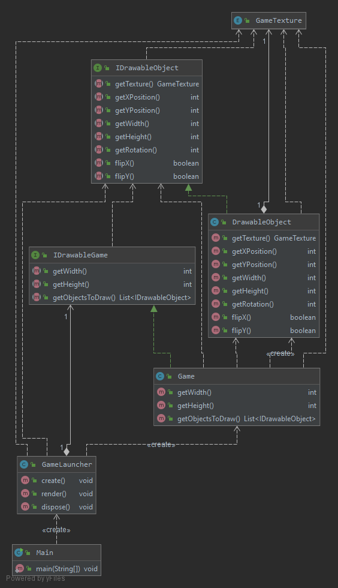

# Team Fiasko
## Organisering av teamet

### Kompetanse

#### Petter Tobias Madsen
Relevante fag: INF101. 
Kan grunnleggende ting i Java men har ikke utført krevende prosjekter. 
Nesten ingen GUI-erfaring.

#### Steinar Aalstad Lillesund
Føler seg komfortabel med Java men ikke noe veldig avansert. 
Ingen GUI-erfaring.

#### Kristian Knarvik
Relevante fag: INF100, INF101 og INF102. 
Ganske erfaren i Java og har gjort ting med GUI før.

#### Torbjørn lunde jensen
Relevante fag: Tar INF101 inneværende semester.
Litt erfaring, men ikke veldig mye. 
Ingen GUI-erfaring.

#### Gabriel Ingolf Olav Magnus
Relevante fag: INF101 og INF102. 
Litt komfortable med Java.

### Oppsummering

Overall kompetanse i java koding ligger på medium mens erfaring med git eller gui er relativt lav. 

### Roller

#### Titler

Kristian -> Teamleder (Ansvarlig for å vite hva alle gjør og burde gjøre til enhver tid) 

Tobias -> Kommunikasjonsleder ( planlegger møter og parprogrammerings timer)

Steinar -> Møteorganisator (Ansvarlig for å organisere hva som skal gjennomgås på de avtalte møtene.)

Torbjørn -> Dokumentasjonsansvarlig (dokumenter møtene og sørger for at innleveringene er riktig)

Gabriel -> Kundekontakt (Ansvarlig for å vite alle spilleregler)

#### Grunnlag

Komunikasjonsleder -> Vi trenger noen som kan ta ansvar for å planlegge tidspunkter for møter, 
                      og en kontaktperson dersom noen ikke kan stille på møter.

Teamleder -> En som har oversikt over prosjektet og sørger for at prosjektet holder seg innenfor et gitt rammeverk.

Møteorganisator -> Skal organisere møtene slik at vi har en plan før hvert møte. Dette forhindrer møter uten en plan.

Dokumentasjonsansvarlig -> Skal sørge for at det finnes korrekt dokumentasjon som overholder gitte krav.

Kundekontakt -> Det er lettere at en har oversikt over spilleregler og har ansvar for riktig spillmekanikk.

## Produktutforming

### Overordnet mål

Vi vil lage en fungerende digital versjon av RoboRally som er kompatibel med MAC, Windows og Linux.
Applikasjonen må kunne kjøre og fungere uten å ha noen ødeleggende feil eller mangler.
Det skal kunne fungere over LAN med opptil 8 spillere.
Spillet skal implementere alle spillereglene fra RoboRally (om tiden strekker til).

### Systemkrav

-   En visuell representasjon av et spillbrett.

-   En spiller som kan bevege seg på brettet.

-   En spiller taper når de mister alle liv.

-   En spiller dør om de tar 10 skade.

-   En spiller trenger liv. 

-   Spilleren trenger å kunne ta skade.

-   En spiller må kunne vinne.

-   Kort for å programmere roboten. 

-   Forskjellige funksjonelle objekter/ruter på kartet (eks. vegg, laser).

-   Runder (Består av 5 faser. Du får nye kort, reparasjon, powerdown etc.).

-   Faser (Ett kort fra hver spiller blir brukt, og objekter på brettet interagerer. 
    Registrering av flagg skjer etter hver fase).

-   Kunne spille med andre spillere over lan.

-   Lasere skyter i slutten av hver fase.

-   Spillere beveger seg hver fase og kort bestemmer hvem som går først.

-   Velge kort i starteren av runden.

-   Kunne velge powerdown etter alle har låst kortene sine.

-   Ved slutten av runden får spillere reparasjoner hvis de står på en reparasjonsbrikke eller flagg.

-   Sjekke om noen spillere står på riktig flagg.

-   Respawn etter en robot er ødelagt ved slutten av runden/fasen gitt at de har flere liv.

-   Hvis en spiller er i powerdown blir spilleren spurt (i starten av nye runden) om han vil bli i powerdown eller ikke.

-   Roboter må kunne dytte hverandre.

-   Samle inn kort i slutten av en runde.

-   Ikke samle sammen kort som er låst.

-   Vise hendelser som skjer på skjermen med en delay slik at spillet ser riktig ut.

-   Roboter dør hvis de går utenfor spillbrettet eller faller i ett hull.

### Prioriterte krav

1.  En visuell representasjon av et spillbrett.
2.  Ha en brikke plassert på det visuelle spillbrettet. 

### Prosjektmetodikk

-   To fysiske møter per uke. En på gruppetimen og en på torsdager. 

-   Siden det ikke alltid er optimalt å møtes fysisk vil en del 
    av parprogrammeringen skje ved hjelp av skjermdeling på Discord.

-   Syklus oppsett mellom hver oblig. Sette opp oppgaver over hva som skal gjøres i hver syklus, som i scrum.

-   Vi skal ha en liten sprint som varer en uke hvor vi prøver å blir ferdig med 
    alle oppgavene som blir tildelt på tirsdagene som i scrum oppsettet.

-   Vi tenker å bruke en blanding av scrum og parprogrammering under prosjektet.

-   Tirsdager brukes for å oppsumere hva som har blitt gjort uken før 
    og for å avklare om vi føler oss ferdig med oppgaver.

-   Deling av dokumenter skjer over GitHub, Slack eller Discord.

-   Bruke prosjekttavle for å ha kontroll over alle oppgavene og hvem som skal gjøre hva.

-   Arbeidsfordelingen skal bli gjort med hver enkeltes kompetanse og evner tatt i betraktning 
    slik at en ikke blir for overbelastet under prosjektet.

#### Prosessen

-   Planlegger møter god tid i forveien.

-   Diskutere ting vi må ta felles på møter og planlegge arbeidoppgaver som skal gjøres til neste møte.

-   Vi har planlagt å ha parprogrammeringstimer slik at alle føler seg komfortable med oppgavene 
    og slik at alle får bidratt til prosjektet.

-   Diskutere spilldesignet sammen i gruppen slik at alle er på samme nivå.

-   Torsdag er satt av for parprogrammering kl. 10:15-12:00.

-   I slutten av en lang sprint (slutten av hver oblig) skal vi se over designet 
    og koden i tilfelle vi føler vi må refaktorere mer eller endre noen andre designaspekter.
    
-   I slutten av en lang sprint (slutten av hver oblig) skal vi se over designet og koden i tilfelle 
    vi føler vi må refaktorere eller endre noen andre designaspekter.

-   Kommunikasjon skjer over Slack og Discord.

#### Organisering i starten

-   Planlegger å jobbe med deloppgavene i oblig 1.
-   Sette opp møtetider og møtesteder, samt hva som skal bli gjort.
-   Planlegger parprogrammerings-økter for den første kode-delen.

### Brukerhistorier

#### Vise et brett

-   Som spiller må jeg kunne se et brett for å kunne spille spillet.
-   Som spiller må jeg kunne se alle elementer på spillbrettet for å kunne programmere roboten.
-   Som spiller må jeg kunne se et rutenett på spillbrettet for å kunne bedømme avstanden 
    roboten må bevege seg for å nå et spesefikt punkt på spillbrettet.

##### Akseptansekrav for brett

-   Vi kan se et brett der noe kan bli plassert på brettet i en rute.
  
#### Plassere en brikke på brettet

-   Som brikke må jeg kunne plasseres på spillbrettet for å være en del av spillet.
-   Som brikke må jeg være synlig på brettet for å kunne vise spilleren hvor jeg er.

##### Akseptansekrav for brikke på brettet

-   Brikken blir plassert synlig i en bestemt rute på brettet.

### Oppsumering

-   Gruppen er enig om at denne første perioden har vært ganske kaotisk. Dette kommer av at gruppen har 
    hatt en del arbeid med å få til det administrative for å kunne jobbe med metodikkene vi har valgt. 
    Dette forventer vi forbedrer seg i neste sprint.

-   Det har også vært en del forandringer på rollene til medlemmene i teamet ettersom vi har blitt bedre 
    kjent med hverandre, og funnet ut hvilke roller som hver enkelt burde ha. Vi endte opp med å bytte leder og de 
    fleste andre roller fire dager før innleveringsfristen.

-   Vi føler parprogrammering fungerer bra, og planlegger å fortsette med dette i neste sprint.

-   Vi ønsker å lage bedre og mer presise issues på prosjekttavlen, ettersom noen av issuene på 
    boardet var for store og ikke spesifikke nok.

-   Vi valgte å bruke tid på Travis siden det gir en rask respons om noe som forventes å kjøre 
    ikke kjører allikevel, slik at det kan bli fikset så snart som mulig. Det er spesielt nyttig 
    om noen kommer til å glemme å teste koden før de sender den til GitHub.

-   Vi valgte å bruke tid på å sette opp Codacy fordi tjenesten hjelper med å holde kvaliteten 
    på koden på et høyt nivå. Det ville vært mulig å sette det opp senere i prosjektet, men det 
    er mye lettere å holde seg på et høyt kvalitetsnivå enn å komme seg opp på et høyt kvalitetsnivå 
    fra et dårlig kvalitetsnivå.

-   Vi har ikke tatt referat fra de tidligere møtene denne perioden fordi vi var ikke klar over at det var et krav før 
    etter at vi hadde hatt de fleste av møtene våre. men vi planlegger å gjøre det i fremtiden.

## UML

